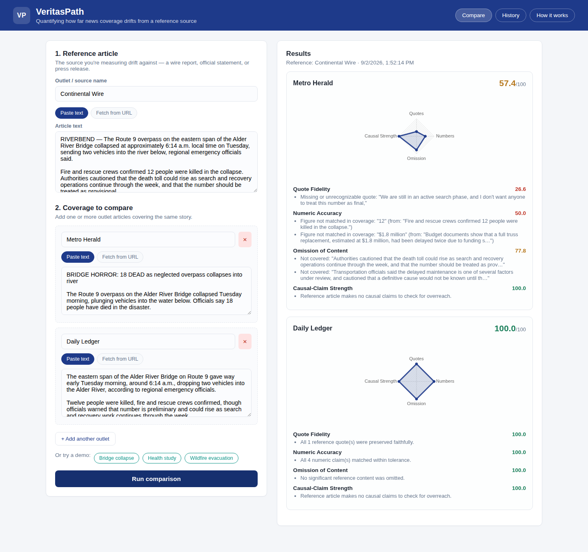
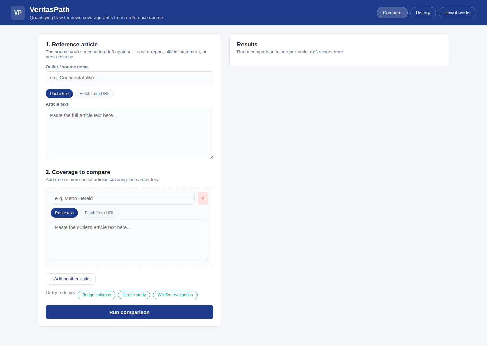
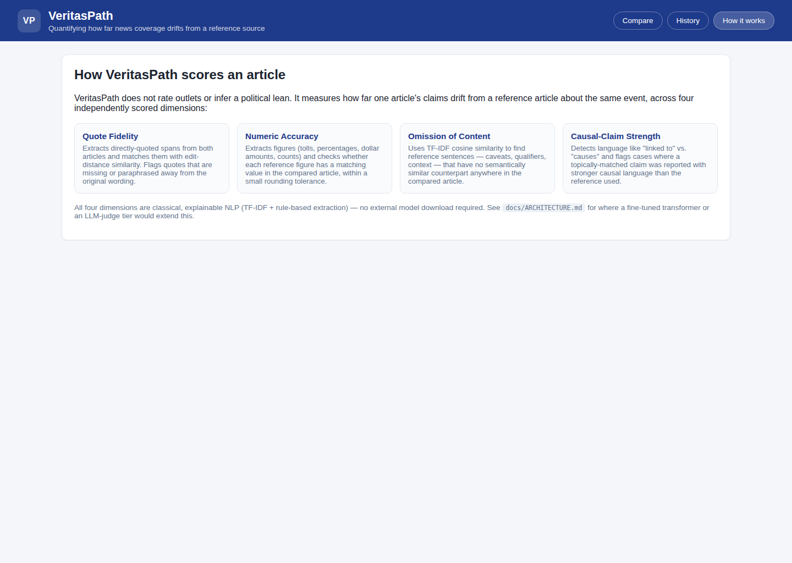

# VeritasPath

**A Java/Spring Boot tool that quantifies how far a news article drifts from a reference source — across four measurable dimensions, not a single "bias score."**

> Built as a student project. This README explains what it does, how it works, why it's built this way, and what its limitations are.

---

## The problem

When the same event is covered by five outlets, readers have no fast way to tell *what actually changed* between the wire report and the headline they're reading — a dropped caveat, an inflated number, a quote taken out of context, a "linked to" that quietly became a "causes." Reading five articles side by side to catch this is tedious, and nobody does it. Existing tools rate *outlets* (AllSides, Ad Fontes) by political lean, which doesn't tell you whether *this specific article* changed *this specific fact*.

VeritasPath answers a narrower, more useful question: **given a reference article (a wire report, an official statement, a press release) and a second article covering the same story, exactly where and how much did the second article drift from the first?**

## What it measures

Every comparison is scored across four independent, named dimensions — not one opaque "bias" number:

| Dimension | What it catches | Method |
|---|---|---|
| **Quote Fidelity** | Quotes that were dropped, misattributed, or paraphrased away from what was actually said | Extracts quoted spans, matches them across articles with edit-distance (Levenshtein) similarity |
| **Numeric Accuracy** | Death tolls, percentages, dollar figures, or counts that don't match | Regex + light NLP extraction of figures (digits and spelled-out numbers), normalized and tolerance-matched |
| **Omission of Content** | Caveats, qualifiers, and context that quietly disappeared | TF-IDF cosine similarity finds reference sentences with no semantic match anywhere in the compared article |
| **Causal-Claim Strength** | "Associated with" that became "causes" — classic overreach | Rule-based causal-language detector, applied to topically-matched sentence pairs |

Each dimension is scored 0–100 and shown with the specific findings that produced the score (which quote, which figure, which sentence). The four scores are combined into a single weighted **alignment score**, but the dimension breakdown — not the composite — is the point: it tells you *what kind* of drift happened, not just *how much*.

## Screenshots

**Comparing two outlets against a reference wire report:**


**Comparison input form:**


**History of past comparisons:**


**How-it-works explainer built into the dashboard:**


---

## Quick start

**Prerequisites:** JDK 17+ and Maven (or use the included `mvnw` if present in your environment — this repo uses a system Maven install).

```bash
git clone <this-repo-url>
cd VeritasPath
mvn spring-boot:run
```

Open **http://localhost:8080**. On first launch the app seeds three demo comparisons (a bridge-collapse wire story, a health-study press release, and a wildfire briefing — see [Demo data](#demo-data)) so the dashboard isn't empty. Click **"Bridge collapse"** (or either other demo chip) on the Compare tab to load a ready-made example, or paste your own reference + comparison article text.

Run the test suite:

```bash
mvn test
```

Build a runnable jar:

```bash
mvn -DskipTests package
java -jar target/veritaspath.jar
```

The app stores comparison history in a local H2 file database (`./data/veritaspath.mv.db`, gitignored) — delete that folder to reset history and re-seed the demos on next startup.

---

## API

VeritasPath is a normal REST + static-frontend Spring Boot app; the dashboard is just a client of its own API.

### `POST /api/comparisons`

```bash
curl -X POST http://localhost:8080/api/comparisons \
  -H "Content-Type: application/json" \
  -d '{
    "reference": { "outletName": "Wire Service", "text": "Officials confirmed 12 people were killed. \"We are still searching the area,\" said the fire marshal." },
    "comparisons": [
      { "outletName": "Tabloid Times", "text": "Officials say 18 people died. \"This was a disaster waiting to happen,\" the fire marshal said." }
    ]
  }'
```

Either article can be supplied as `"text"` (paste) or `"url"` (VeritasPath fetches and extracts the article body via Jsoup). Returns a `ComparisonResponse` with a per-outlet `alignmentScore`, the four `dimensions` (each with its own `score` and human-readable `findings`), and sentence counts — and persists the run to history.

### `GET /api/comparisons/history`

Returns the 20 most recent comparison runs (used by the dashboard's History tab).

### `POST /api/articles/preview`

```bash
curl -X POST http://localhost:8080/api/articles/preview \
  -H "Content-Type: application/json" \
  -d '{"url": "https://example.com/some-article"}'
```

Fetches a URL and returns the extracted article text, so the dashboard can show you what it scraped before you submit it for comparison.

---

## Demo data

`src/main/resources/sample-data/` contains three fictional scenarios (invented outlets and officials — not real events or people) hand-built to exercise each dimension:

- **`bridge-collapse/`** — a wire report vs. a faithful outlet (near-perfect score) and a sensationalized outlet (inflated death toll, dropped caveats, fabricated quote, causal overreach)
- **`energy-drink-study/`** — a research institute's careful, hedged release vs. a blog that drops the "observational, not causal" caveat and upgrades "associated with" to "causes"
- **`wildfire-evacuation/`** — an emergency-management briefing vs. an outlet that collapses an estimate range into a hard number and drops the "preliminary estimate" caveat

The same text is duplicated in `src/main/resources/static/js/sample-data.js` so the dashboard's demo chips can pre-fill the form without an extra round trip — see that file's header comment if you edit the scenarios.

---

## How it's built

- **Backend:** Java 17, Spring Boot 3 (Web, Data JPA, Validation), Maven
- **NLP:** hand-implemented, not pulled from a library — sentence segmentation, TF-IDF vectorization, and cosine similarity are all written from scratch in `com.veritaspath.nlp` (~250 lines total) so the scoring logic is transparent and defensible, not a black box. See [`docs/ARCHITECTURE.md`](docs/ARCHITECTURE.md) for why, and where a pretrained model would slot in as a later tier.
- **Article fetching:** [Jsoup](https://jsoup.org/) for URL → HTML → article-text extraction (readability-style heuristics, no per-outlet scraper rules)
- **Persistence:** H2 file database via Spring Data JPA (comparison history)
- **Frontend:** static HTML/CSS/vanilla JS dashboard (no build step), charts via a locally vendored copy of [Chart.js](https://www.chartjs.org/) (`static/js/vendor/chart.umd.js` — vendored rather than CDN-loaded so the app has zero external runtime dependencies and works fully offline)
- **Tests:** JUnit 5 + AssertJ, 33 tests — 27 unit tests for the NLP primitives and scoring dimensions, plus an accuracy evaluation (see below) — all run via `mvn test`

Full package layout and the reasoning behind each design decision are in [`docs/ARCHITECTURE.md`](docs/ARCHITECTURE.md).

## Accuracy

There's no external ground-truth dataset for the full "semantic drift" task this project defines (see Known limitations below) — no one publishes labeled reference-vs-coverage article pairs — so the headline numbers below mean agreement with hand-labeled expectations, not an independently verified benchmark. That's the same honesty tradeoff [the original project brief](docs/ARCHITECTURE.md) called out for Phase B labeling. One dimension, however, *has* been checked against real, professionally-annotated external data — see the second half of this section.

### Internal evaluation (all four dimensions)

`src/test/java/com/veritaspath/eval/AccuracyEvaluationTest.java` runs 11 article pairs across six domains *not* used anywhere else in the test suite or the seeded demo data (sports, corporate earnings, courts, science reporting, weather, local government), each hand-labeled with the expected score range per dimension, and prints a full pass/fail report on every `mvn test` run:

```
Overall: 27/28 expectations matched (96.4%)
  Quote Fidelity           7/7  (100.0%)
  Numeric Accuracy         7/8  (87.5%)
  Omission of Content      9/9  (100.0%)
  Causal-Claim Strength    4/4  (100.0%)
```

This batch is what actually found two real gaps — sports scores ("28 points") and weather measurements ("10 inches") weren't recognized as numeric claims because the count-context word list was tuned for hard-news vocabulary, and "X caused Y" (bare past tense, no "by") wasn't in the causal-keyword list. Both are fixed in `nlp/NumericClaimExtractor` and `nlp/CausalStrengthAnalyzer`. The one remaining failure — a reference's "seven games" not matching a paraphrase's "seventh straight win" — is a genuine, documented limitation (cardinal/ordinal number words aren't matched to each other), left in the suite on purpose so a future fix has to touch this test deliberately rather than the number quietly changing.

### External validation (all four dimensions)

`tools/external-validation/` validates every dimension's underlying primitive against real, independently published, human- or professionally-annotated data — not test data this project wrote itself. Full methodology, exact numbers, and scope caveats (none of these benchmarks perform VeritasPath's actual two-article comparison task; each validates the narrower primitive a dimension is built on) are in [`docs/EXTERNAL_VALIDATION.md`](docs/EXTERNAL_VALIDATION.md):

| Dimension | Benchmark | Result |
|---|---|---|
| Causal-Claim Strength | SemEval-2020 Task 11 (PTC v2) — [zenodo.org/records/3952415](https://zenodo.org/records/3952415) | **4.8% recall** on real propaganda (up from a 1.0% baseline) |
| Quote Fidelity | STS Benchmark (SemEval-2017 Task 1) | Pearson r=0.41; **19.2%** of true paraphrases wrongly scored "missing" |
| Omission of Content | STS Benchmark (same data) | Pearson r=0.66; **97.9%** of true paraphrases correctly pass the threshold |
| Numeric Accuracy | Numeracy-600K (ACL 2019) | **37.5%** adjusted recall on real headline numerals |

The pattern across three of the four: a method that scores ~96–100% on this project's own synthetic test data drops sharply against real, naturally-varied text — not from a bug, but because keyword matching and character edit-distance are structurally blind to paraphrase, negation, and implicit meaning. This is honest, external evidence for exactly the limitation `docs/ARCHITECTURE.md` already argued from first principles, now backed by numbers instead of an assertion. Notably, Omission of Content's TF-IDF cosine primitive is the one that held up well externally (r=0.66) — bag-of-words content-word overlap is a genuinely more robust signal here than character- or keyword-level matching. For Quote Fidelity, the natural fix (lowering the "missing" threshold) was checked against real data before touching any code, and rejected — see the doc for why. That's why a fine-tuned transformer (Phase B on the roadmap) is the actual fix for the other three, not a bigger keyword list or a moved threshold.

## Known limitations

Documented honestly rather than glossed over — see `docs/ARCHITECTURE.md` for the full list, but briefly:

- **Negation isn't handled.** "We cannot say the beverage *causes* headaches" is detected as a *strong* causal claim, because the keyword matcher doesn't see the "cannot say" in front of it. A real fix needs dependency parsing or a small classifier, not more keywords.
- **The causal-language detector misses most real-world causal oversimplification.** Validated against real SemEval-2020 Task 11 propaganda data: 4.8% recall (see Accuracy above and `docs/EXTERNAL_VALIDATION.md`). It catches explicit "causes"/"leads to"/"responsible for"-style language well but not counterfactuals, implicit blame, or rhetorical insinuation — which is most of how real propaganda actually expresses oversimplified causation.
- **Quote Fidelity's Levenshtein similarity can't cleanly separate "paraphrased" from "unrelated."** Validated against STS Benchmark: 19.2% of genuinely equivalent sentence pairs would score as a "missing" quote rather than "altered." Checked whether lowering the threshold would help — it wouldn't (unrelated sentences reach similar Levenshtein scores at the 95th percentile) — so this is left as a documented limitation rather than a moved threshold that trades one error for another.
- **TF-IDF is a bag-of-words model.** It catches paraphrase overlap well but doesn't understand negation or sentence structure — "the bridge didn't collapse" and "the bridge collapsed" look similar to it. This is a deliberate scope choice (see Architecture doc), not an oversight. It's also the strongest-performing primitive of the four under external validation (STS Benchmark Pearson r=0.66) — bag-of-words content overlap is a more robust signal than character- or keyword-level matching for this kind of task.
- **English-only, and tuned for news-style prose.** The abbreviation list, causal-phrase dictionary, and count-context words are hand-curated for the demo domain.

## Roadmap (explicitly out of scope for this build)

This project deliberately stops at the classical-NLP tier. If continued, the natural next steps — in the same order the original project brief phased them — are:

1. **Phase B — fine-tuned transformer.** Replace TF-IDF cosine similarity with a BERT-family model fine-tuned per dimension, to fix the negation/paraphrase blind spots above.
2. **Phase C — zero-shot LLM scoring.** Structured JSON prompting as a third, comparable tier — likely stronger on inferential overreach (Causal-Claim Strength), likely no better than the classical baseline on Numeric Accuracy.
3. **Cryptographic anchor ingestion.** Generate a C2PA manifest (via `c2pa-rs`/`c2pa-js` — real tooling, not homebrew crypto) for the reference document so "reference" means *cryptographically verified*, not just "the first article you pasted in."
4. **Cascade attribution.** Given 5+ articles on one story, infer a citation graph (who copied whom) and attribute drift to the specific hop where it entered, instead of only ever comparing pairwise against one reference.

## License

MIT — see [`LICENSE`](LICENSE).
