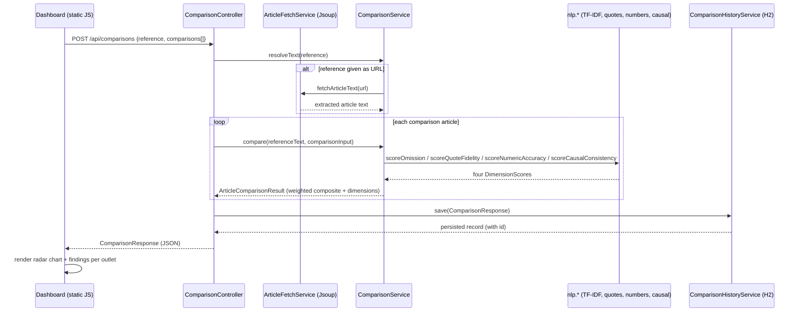

# Architecture

This document explains how VeritasPath is put together and, more importantly, *why* — the design decisions a reviewer would ask about.

## Request flow



## Package layout

```
com.veritaspath
├── VeritasPathApplication      Spring Boot entry point
├── nlp/                        Pure, dependency-free scoring primitives (unit-tested in isolation)
│   ├── TextUtils                sentence segmentation, tokenization, stopword filtering
│   ├── TfIdfVectorizer           TF-IDF over a fixed document set
│   ├── CosineSimilarity          vector cosine similarity + Levenshtein string similarity
│   ├── QuoteExtractor            pulls "..." / "..." spans out of text
│   ├── NumericClaimExtractor     pulls figures (digit and spelled-out) out of text
│   └── CausalStrengthAnalyzer    detects "linked to" vs "causes"-class language
├── model/                       Small immutable records used by the nlp layer
│   ├── Quote, NumericClaim, CausalSignal, DimensionScore
├── service/
│   ├── ArticleFetchService       URL → article text (Jsoup)
│   ├── ComparisonService         orchestrates the four dimensions into a composite score
│   └── ComparisonHistoryService  persists/reads comparison runs
├── controller/
│   ├── ComparisonController      POST /api/comparisons, GET /api/comparisons/history
│   ├── ArticleController         POST /api/articles/preview
│   └── GlobalExceptionHandler    turns validation/fetch failures into small JSON errors
├── dto/                          Request/response shapes (separate from persistence entities)
├── entity/ + repository/         JPA entity + Spring Data repository for comparison history
└── config/
    └── SampleDataSeeder          seeds 3 demo comparisons on first startup
```

`nlp/` has zero Spring dependencies on purpose — every class in it is a plain, testable Java class with static methods or a tiny constructor. That's why `ComparisonServiceTest` can `new ComparisonService(null)` and call it directly without a Spring context: the scoring logic doesn't need a web server or a database to be correct.

## Why classical NLP instead of a pretrained model or an LLM

This is a deliberate choice, not a limitation of time alone:

1. **No external model download.** Libraries like Apache OpenNLP or spaCy-via-bridge need a `.bin`/pipeline download at build or first-run time. In a sandboxed or offline grading/CI environment, that's a build that silently fails. TF-IDF, cosine similarity, and a Levenshtein distance are ~250 lines of plain Java with no external state.
2. **Explainability.** Every score in this project traces back to a specific quote, a specific number, or a specific sentence pair — because the underlying math (term frequency × inverse document frequency, dot product of two vectors) is fully inspectable. A fine-tuned BERT classifier would score similarly well on the demo data but couldn't tell you *why* in a way a non-ML reader could verify by hand.
3. **It's the documented Phase A of the source idea.** The original project brief phased this build as classical-ML baseline (Phase A) → fine-tuned transformer (Phase B) → zero-shot LLM (Phase C), specifically so Phase A "establishes a validation floor" before adding model complexity. This build *is* Phase A, shipped as a complete, defensible tool on its own — not a stub.

### TF-IDF, concretely

For each pair of articles being compared, `TfIdfVectorizer` treats every sentence (from both articles) as one "document" in a small corpus:

- **Term frequency (TF):** how often a word appears in *this* sentence, divided by the sentence's word count.
- **Inverse document frequency (IDF):** `log((1 + N) / (1 + df)) + 1`, where `N` is the number of sentences in the corpus and `df` is how many of them contain the word. Smoothed (`+1` in both numerator and denominator) so a word appearing in every sentence — usually the subject of the article, e.g. "bridge" in a bridge-collapse story — doesn't get an undefined or zero weight.
- **TF-IDF vector:** `TF × IDF` per word, then L2-normalized so cosine similarity between two vectors is just their dot product, bounded in `[0, 1]`.

Stopwords (articles, prepositions, auxiliary verbs, "said") are removed before vectorizing — otherwise every sentence pair would look artificially similar because they share "the," "a," and "said."

### The four dimensions, precisely

| Dimension | Formula | Notes |
|---|---|---|
| Quote Fidelity | `100 × mean(best_match_similarity)` over each reference quote, where `best_match_similarity` is the highest Levenshtein similarity to any quote in the compared article | A quote below 50% similarity is reported as "missing," 50–85% as "altered/paraphrased" |
| Numeric Accuracy | `100 × (matched claims / total reference claims)` | A claim "matches" if within 2% relative tolerance of some claim in the compared article, or exact for equal values |
| Omission of Content | `100 × (1 − omitted / considered)` | Only reference sentences ≥40 characters are "considered" (skips short transitional sentences); "omitted" = no target sentence with TF-IDF cosine similarity ≥ 0.12 |
| Causal-Claim Strength | `100 × (1 − overreach / total causal signals)` | A ref sentence with a causal keyword is topic-matched (cosine ≥ 0.20) to its best sentence in the compared article; overreach = that sentence uses a *stronger* causal keyword (weak → moderate → strong) |

The composite **alignment score** is a weighted average: Quote Fidelity 30%, Numeric Accuracy 30%, Omission 25%, Causal-Claim Strength 15%. Quotes and numbers are weighted highest because they're the most objectively checkable claim types; causal strength is weighted lowest because the rule-based detector is the least precise of the four (see limitations below).

All thresholds (0.12, 0.20, 0.85, 2%, 40 characters, the dimension weights) are named constants at the top of `ComparisonService` — tune them there, not scattered through the scoring methods.

## Known limitations (and why they're left as-is)

Being explicit about what this *doesn't* handle is more defensible in review than pretending it's complete:

- **Negation is invisible to keyword matching.** `CausalStrengthAnalyzer` matches the phrase "causes" whether or not it's preceded by "cannot say ... " or "does not." Fixing this properly needs a dependency parse (is the causal verb inside the scope of a negation?) or a small trained classifier — not a bigger keyword list, which would just trade false negatives for false positives ("X does not cause Y" written by a *careful* outlet would then wrongly score as consistent with itself). This is flagged explicitly in the README rather than silently shipped.
- **The causal-language detector has low recall on real propaganda text.** Validated against SemEval-2020 Task 11's professionally-annotated Propaganda Techniques Corpus: **4.8% recall** (10/208) on human-labeled `Causal_Oversimplification` sentences, up from a 1.0% baseline after two rounds of keyword additions this validation drove — full methodology in `docs/EXTERNAL_VALIDATION.md`. The false negatives are almost entirely counterfactuals ("would still be alive were it not for..."), implicit blame attribution, and rhetorical insinuation with zero causal connective words — a ceiling no keyword list can cross, confirmed by checking: at most a handful of the 198 remaining misses contained any plausible additional keyword at all. This is the strongest evidence in this project for why Phase B (below) is necessary rather than optional polish.
- **TF-IDF has no notion of negation or word order.** "The bridge collapsed" and "the bridge did not collapse" share almost all their significant tokens and score as similar. This is the textbook limitation of a bag-of-words model, and it's the main reason Phase B (a fine-tuned transformer) is next in the roadmap rather than "more TF-IDF." It's also, externally validated, the *best-performing* primitive of the four (STS Benchmark Pearson r=0.66, see below) — the limitation is real, but bag-of-words content overlap is still a meaningfully more robust signal here than character- or keyword-level matching.
- **Quote Fidelity's Levenshtein similarity cannot reliably separate "paraphrased" from "unrelated."** Validated against STS Benchmark (SemEval-2017 Task 1): Pearson r=0.41 against human similarity judgment, and on genuinely-equivalent sentence pairs, 19.2% would be misclassified as a "missing" quote (implying fabrication/dropped attribution) rather than "altered" (a paraphrase). The obvious fix — lower the 0.5 "missing" threshold — was checked against the same data before touching code: unrelated sentence pairs reach a 95th-percentile Levenshtein similarity of 0.69, *above* the current threshold, so lowering it would trade "missing" false negatives for "altered" false positives on genuinely unrelated quotes, arguably a worse error. No threshold change was made. Full numbers in `docs/EXTERNAL_VALIDATION.md`.
- **Numeric extraction is regex + a curated word-number list (one–ninety), not a general number parser.** "A couple hundred" or "dozens of" won't be caught. The count-context word list (`people`, `killed`, `percent`, `points`, `inches`, ...) is hand-curated and was broadened once already after the accuracy evaluation below caught it missing sports scores ("28 points") and weather measurements ("10 inches") — it's still a curated list, not exhaustive, so an unseen domain can still slip through it. Validated against Numeracy-600K (600K real headlines): 37.5% adjusted recall — most of the gap to 100% turned out to be the benchmark measuring a different thing (its gold label is the bare pre-multiplier digit, e.g. "2.41" for "$2.41 million," where this extractor correctly reports 2,410,000) rather than real misses; see `docs/EXTERNAL_VALIDATION.md` for the full breakdown, including one genuine (rare) regex edge case it surfaced: a number glued directly to a comma with no space before 4+ more digits (e.g. "August 4,2013") can be mis-split.
- **Cardinal/ordinal number words aren't matched to each other.** "seven games" (reference) and "seventh straight win" (a legitimate paraphrase) are the same fact, but the word-number list only covers cardinals, so this scores as an unmatched figure. Found by the accuracy evaluation below — see its one documented failure case.
- **Quote extraction assumes straight/curly double quotes.** Single-quoted attribution (common in UK style) or quotes split across paragraphs aren't handled.
- **Sentence segmentation is rule-based**, with a short abbreviation list (`Dr.`, `U.S.`, `Inc.`, ...) to avoid false sentence breaks. It will occasionally over- or under-split on unusual punctuation (e.g. ellipses, nested quotes with periods).

None of these are silent — the point of naming them here is that a reviewer asking "what breaks this?" gets a real answer instead of a demo that only ever shows the happy path.

## Testing strategy

- **`nlp/*Test`** — each extractor and the vectorizer/similarity math tested in isolation with hand-constructed sentences, independent of Spring or the database.
- **`ComparisonServiceTest`** — five scenario-based tests, one per "what should move this dimension" question (identical article ⇒ ~100 everywhere; a changed number ⇒ lower Numeric Accuracy only; an altered quote ⇒ lower Quote Fidelity only; stronger causal language ⇒ flagged overreach; a dropped caveat ⇒ lower Omission score), run against `new ComparisonService(null)` directly — no Spring context needed since the fetch dependency isn't exercised when text is supplied inline.
- **`eval/AccuracyEvaluationTest`** — a larger, more realistic batch (11 article pairs across sports, corporate earnings, courts, science reporting, weather, and local government — domains not used anywhere else in the test suite or the seeded demo data), each with a hand-labeled expected outcome per dimension. Prints a full pass/fail report to stdout on every `mvn test` run and asserts the overall agreement rate stays ≥90% as a regression guard. Currently measures **27/28 (96.4%)**; the one documented failure is the cardinal/ordinal limitation above, kept in the suite deliberately rather than removed, so a future fix has to update this test on purpose. This batch is what caught and drove the two fixes above (the broadened count-context word list, and a bare "caused" keyword), which is the intended use of this test — a live accuracy signal, not just a fixed pass/fail check.
- **`tools/external-validation/`** — three tools, one per external benchmark, covering all four dimensions' primitives. Not run by `mvn test` (each needs a corpus downloaded separately; see that folder's README) but the only validation in this project against data this project didn't write itself: `SemEvalCausalValidation` (Causal-Claim Strength vs. real SemEval-2020 Task 11 propaganda annotations, 4.8% recall), `StsbSimilarityValidation` (Quote Fidelity and Omission of Content vs. the STS Benchmark's human similarity scores, Pearson r=0.41 and r=0.66 respectively), and `Numeracy600KValidation` (Numeric Accuracy vs. 600K real headline numerals, 37.5% adjusted recall). See `docs/EXTERNAL_VALIDATION.md` for the full picture on each, including why the low numbers are low and what they actually prove.
- All three of the above test the same shipped code from different angles: unit tests check individual primitives are correct on cases with a known right answer, the internal accuracy eval checks the four dimensions behave correctly across realistic scenarios this project controls, and the external validation checks one of those primitives against text nobody on this project wrote or curated. Run the first two with `mvn test`; there is no hidden integration-only path — the scoring logic that ships is the scoring logic that's tested.
